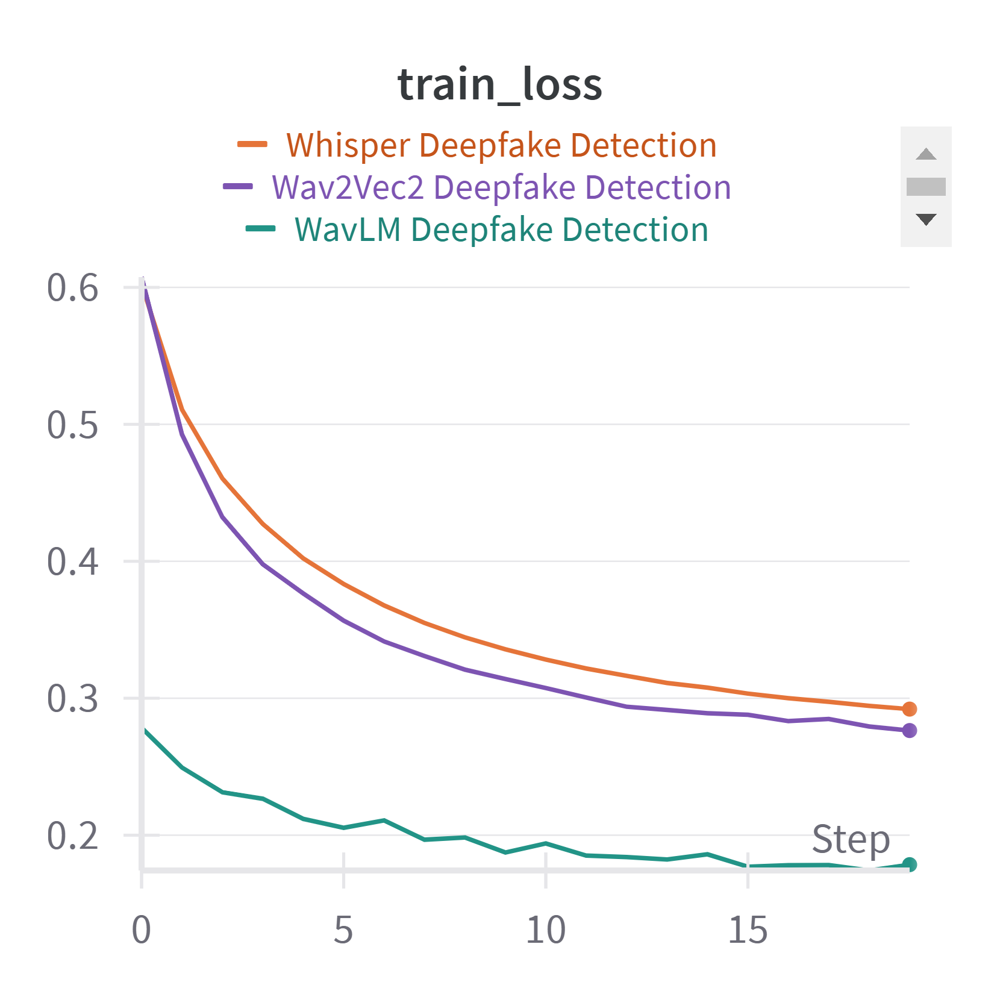
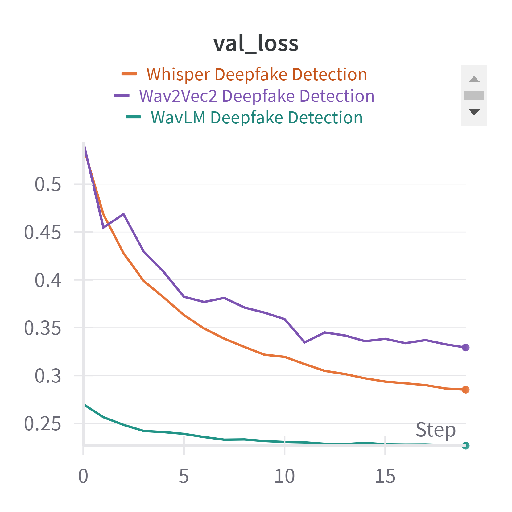
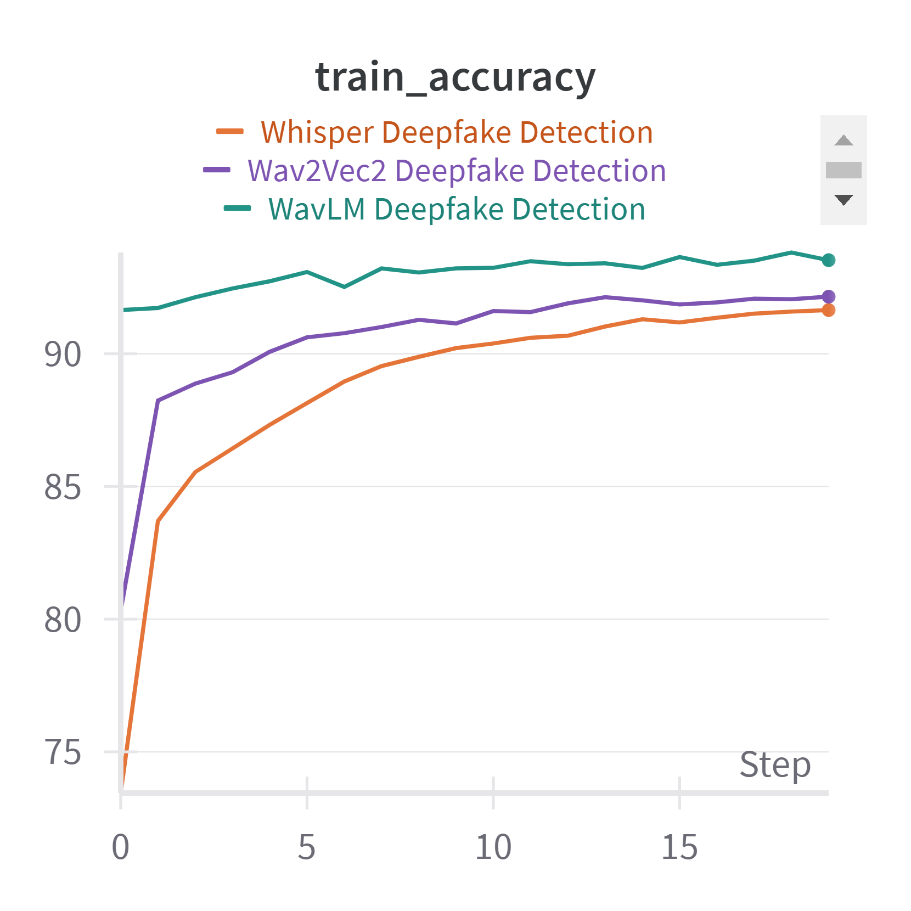
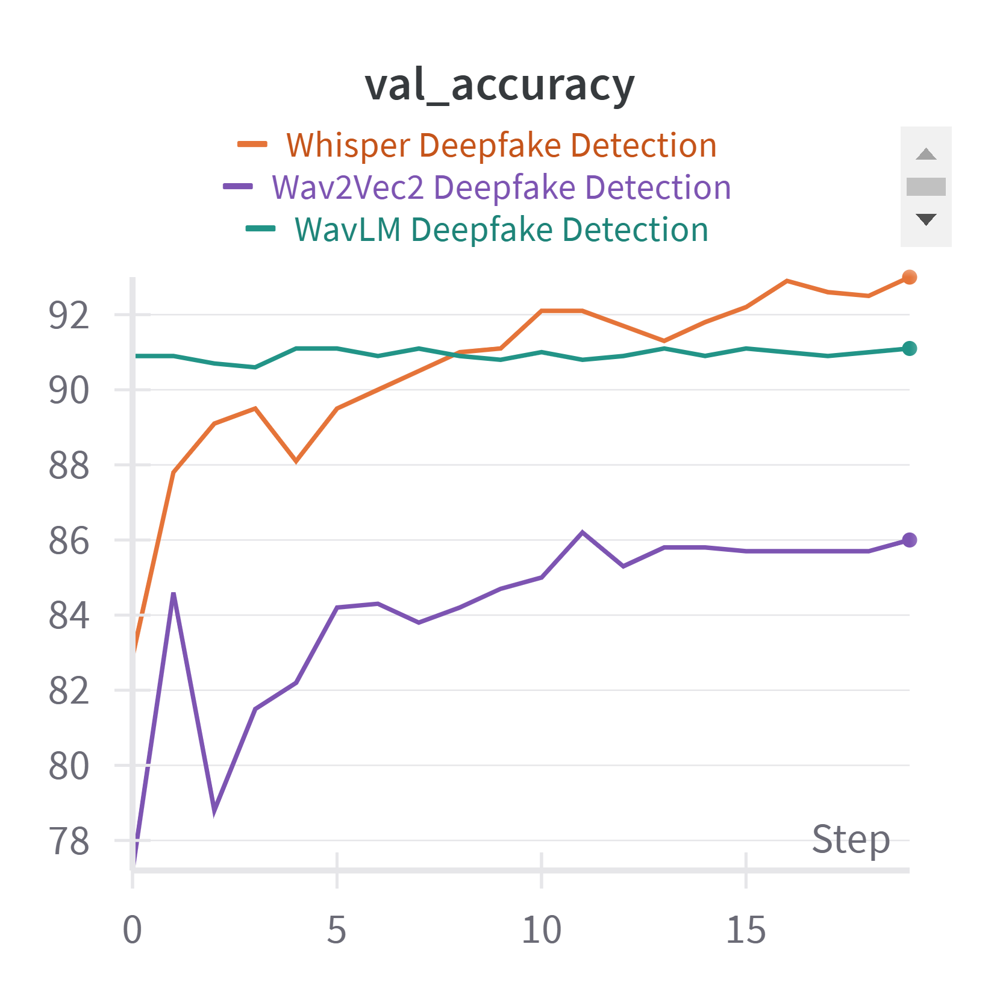

# AudioDeepfakeDetection
Audio Deepfake Detection using Wav2Vec2, Whisper and WavLM.

# Dataset Information
We performed audio deepfake detection on ASVSpoof 2019 Dataset.
* Dataset Link: https://www.kaggle.com/datasets/awsaf49/asvpoof-2019-dataset

# Data Preprocessing

# Experiments
Trained 3 different models: Wav2Vec2, WavLM and Whisper for 20 epochs on T4 GPU.

# Results
## Loss Curves

## Accuracy Curves

# Model Weights:
* WavLM: https://huggingface.co/Jiraheya/WavLM-AudioDeepfakeDetection
* Wav2Vec2: https://huggingface.co/Jiraheya/Wav2Vec2-AudioDeepfakeDetection
* Whisper: https://huggingface.co/Jiraheya/Whisper-AudioDeepfakeDetection/tree/main