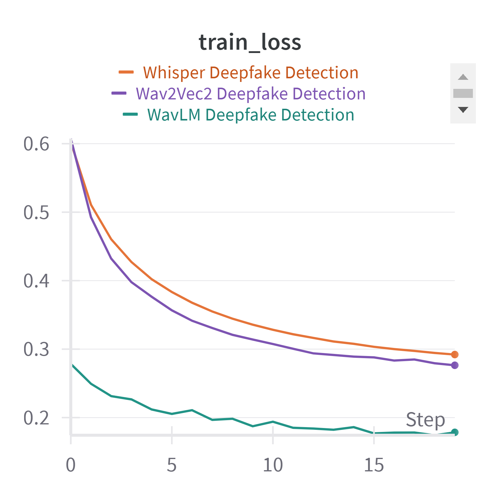
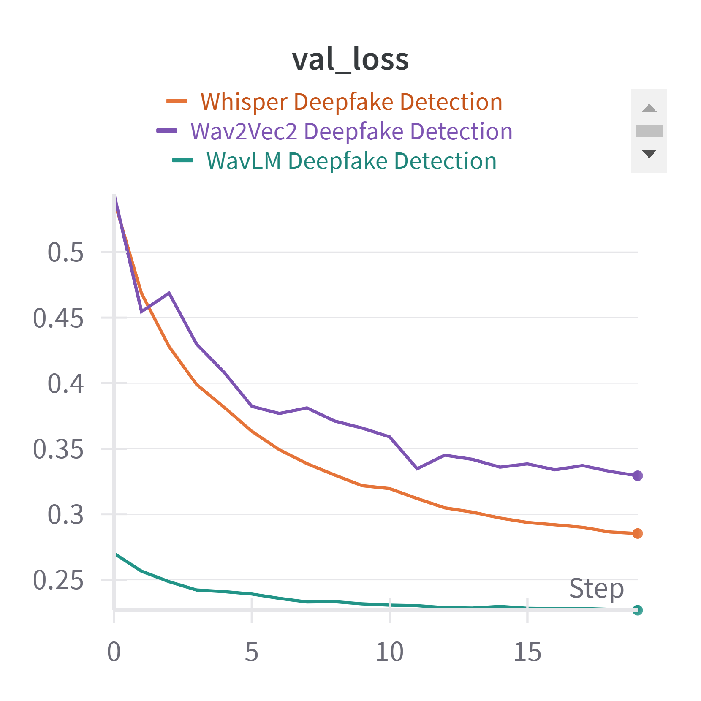
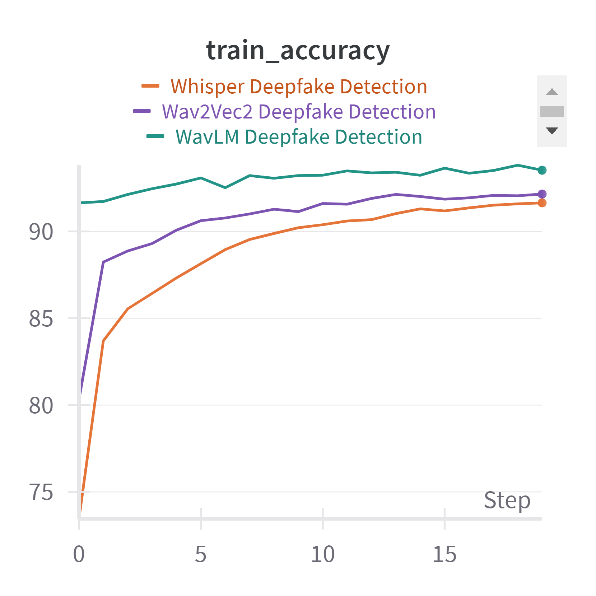
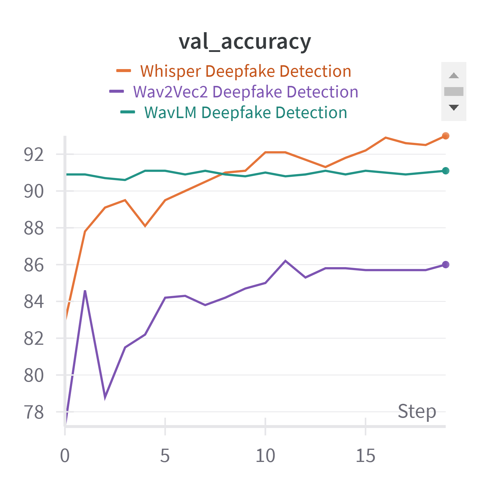

# Class: CMPE258 Section 2, Deep Learning
* This project is a part of Deep Learning course at San Jose State University, serving as a semester project aimed at applying theoritical knowledge to practical deep learning applications.

# Deepfake Audio Detection using WavLM, Wav2Vec2 and Whisper Model

## Project Team
    1. Pratikkumar Dalsukhbhai Korat
        SJSU ID : 017512598
        Email ID: pratikkumardalsukhbhai.korat@sjsu.edu
    2. Avinash Saxena
        SJSU ID : 017507178 
        Email ID: avinash.saxena@sjsu.edu
    3. Gauri Naik
        SJSU ID : 017430842
        Email ID: gauri.naik@sjsu.edu

## Project Stacks

  * Pytorch: Model defintion and training
  * wandb: Model Versioning and Observability
  * streamlit: User Interface
  * onnx: Export and inference optimization
  * transformers: Huggingface library transformer models
  * numpy, pandas, sklearn, matplotlib: Data processing and visualization.

## How To Run Training Scripts
  * Install the required libraries
  * pip install -r requirements.txt
  * Download Resampled Dataset from
    https://drive.google.com/file/d/1PXOKm_O0p2VCAdU6-XGkrBVNE1X4UNn4/view?usp=drive_link
  * Just Run the training script notebooks

## How To Run User Interface
  * Download ONNX exported Models from https://drive.google.com/drive/folders/1BN97aegzlzWjfDhu9R59AoZheOLP0FxK?usp=drive_link 
  * cd frontend
  * streamlit run app.py

## User Interface Screenshot
<centre>

  
   

  
   
  

  
   
  

</centre>
# Key Accomplishments
* We have made significant progress in our Audio DeepFake Detection project using Wav2Vec2, Whisper, and WavLM models. Our key achievements include:
* Implemented a fully functional training script for all three models (Wav2Vec2, Whisper, and WavLM).
* Performed audio feature engineering for improved model performance.
* Conducted comparative analysis of the three models.
* Successfully fine-tuned the pre-trained models for our specific use case.
* Uploaded trained model weights to Hugging Face for easy access and reproducibility.
* Our project's GitHub repository contains all the code and results: https://github.com/AvinashSaxena777/CMPE258-GroupProject-AudioDeepFakeDetection
* The trained model weights are available on Hugging Face:
  * WavLM: https://huggingface.co/Jiraheya/WavLM-AudioDeepfakeDetection
  * Wav2Vec2: https://huggingface.co/Jiraheya/Wav2Vec2-AudioDeepfakeDetection
  * Whisper: https://huggingface.co/Jiraheya/Whisper-AudioDeepfakeDetection/tree/main
* Currently, we are in the process of model export and optimizing inference, which is still in the development phase.

# Baseline Modules Description
We identified and utilized three pre-trained Audio Speech Recognition models as our baseline modules:
* Wav2Vec2: This model is designed for speech recognition tasks and has shown excellent performance in various audio-related applications.
* WavLM: Originally developed for audio deepfake detection, WavLM served as a strong foundation for our project. We extended the work done in a previous research paper to incorporate this model.
* Whisper: Known for its robust speech recognition capabilities, we adapted Whisper for our audio deepfake detection task.
These baseline modules play a crucial role in our project by providing pre-trained representations of audio data. We fine-tuned these models to adapt them specifically for audio deepfake detection. The integration process involved modifying the model architectures to output binary classifications (real or fake) instead of their original speech recognition outputs.

# Results
## Loss Curves

 

## Accuracy Curves

 

# References
Throughout our project, we relied on several key resources:
* https://huggingface.co/docs/transformers/en/model_doc/wavlm
* https://huggingface.co/docs/transformers/en/model_doc/whisper
* https://huggingface.co/docs/transformers/en/model_doc/wav2vec2
* https://pytorch.org/docs/stable/index.html
* Xie, Zeyu, et al. "FakeSound: Deepfake General Audio Detection." arXiv preprint arXiv:2406.08052 (2024).

# Challenges Encountered
* Our main challenge occurred early in the project when we attempted to implement our initial approach of leveraging RAG (Retrieval-Augmented Generation) for audio deepfake detection. The model parameters were exploding, making it infeasible to perform model training.
* Currently, as we are in the phase of model export and optimizing inference, we haven't encountered any significant challenges. However, we anticipate that optimizing the models for efficient inference might present some difficulties.

# Plans to Overcome Challenges and Move Forward
* To address the challenges we faced and continue progressing with our project:
* We pivoted from our initial RAG approach to using pre-trained models (Wav2Vec2, WavLM, and Whisper), which has proven successful so far.
* For the ongoing model export and inference optimization phase, we plan to:
  * Experiment with different quantization techniques to reduce model size without significant performance loss.
  * Explore hardware-specific optimizations for faster inference.
  * We will continue to monitor the performance and efficiency of our models during the optimization phase and make necessary adjustments as challenges arise.
  * Finally, we aim to create a user-friendly interface for easy testing and demonstration of our audio deepfake detection system.
